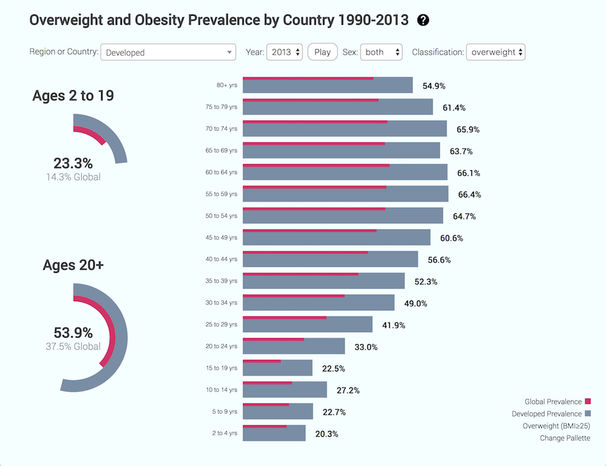

# The Global Burden of Disease Study 2013
### Overweight and Obesity Prevalence by Country 1990-2013
=================



### Version 1.0.0

#### Setting up
In Chrome you can use the following terminal command to allow local file access:

```
open /Applications/Google\ Chrome.app/ --args --allow-file-access-from-files
```

#### Planned Changes
1. Return to ES6.  I had it there, but I felt IE support was more important at this time.
2. Responsive Layout, with arcs shifting above bar chart on smaller devices
3. Change .csv data for better loading and less data usage, most likely hashed

#### Tested Environments
Chrome 58, Firefox 53, Safari 10, Opera 41, Microsoft Edge 40, and Internet Explorer 11

#### Source
Global Burden of Disease Study 2013. Global Burden of Disease Study 2013 (GBD 2013) Obesity Prevalence 1990-2013. Seattle, United States: Institute for Health Metrics and Evaluation (IHME), 2014.

[Source](http://ghdx.healthdata.org/record/global-burden-disease-study-2013-gbd-2013-obesity-prevalence-1990-2013)